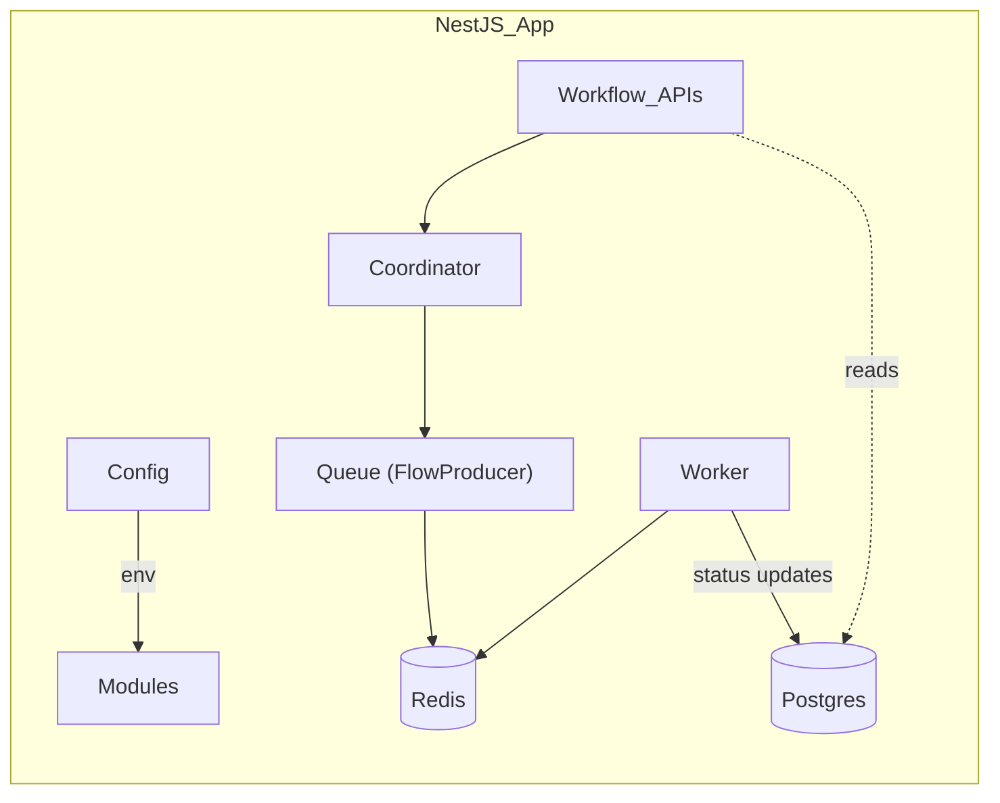

# Queue-Worker POC

A proof-of-concept workflow engine built with **NestJS**, **BullMQ**, **Redis**, and **PostgreSQL** (via TypeORM).

It lets you:

* Define **workflows** (ordered lists of steps).
* Launch workflow **executions** that enqueue each step as a BullMQ job.
* Run tasks in **workers** with retry / back-off logic.
* Persist every change to a relational database.
* Observe jobs in real time with **Bull Board** UI.
* Spin up the entire stack with a single `docker compose up`.

---

## Architecture



### 1. `config`
Centralises connection settings. Reads from environment variables so Docker / CI can inject them.

### 2. `queue`
* `FlowProducerService` – thin wrapper around BullMQ **FlowProducer** for submitting parent / child job graphs.

### 3. `tasks`
* `TaskEntity` – DB record for every BullMQ job (name, data, status, attempts, `executionId`).
* `TaskService` – creates / updates tasks.
* `TaskController` – demo endpoints for ad-hoc sample flows.

### 4. `workflows`
* `WorkflowEntity` – stores the *definition* (`{ steps:[{taskName,data}] }`).
* `WorkflowExecutionEntity` – stores a single run of a workflow (status `IN_PROGRESS|COMPLETED|FAILED`).
* `WorkflowService` / `WorkflowExecutionService` – persistence helpers.
* `WorkflowController` –
  * `POST /workflows` – create definition.
  * `POST /workflows/:name/execute` – start a run.
* `WorkflowModule` seeds a sample `invoice_pdf` workflow on startup.

### 5. `coordinator`
* Translates a workflow definition into a **BullMQ Flow**.
* Creates a `WorkflowExecution` row and one `Task` row per step.
* Provides `executeWorkflow(name)` used by the controller.

### 6. `worker`
* Single BullMQ **Worker** that consumes the `tasks` queue.
* Updates `Task.status` on `completed` / `failed`.
* When the final step of an execution finishes it sets `WorkflowExecution.status = COMPLETED` (or FAILED after last retry).

---

## Getting Started

### Prerequisites
* Docker Engine + Compose v2 (or Docker Desktop)

### One-liner run
```bash
# Build images & run Redis, Postgres, NestJS app
$ docker compose up -d --build
```
Services:
* NestJS API      → http://localhost:3000
* Bull Board UI   → http://localhost:3000/queues
* Postgres         → localhost:5432 (user/pass `postgres`)
* Redis            → localhost:6379

> The database is auto-migrated on first run via TypeORM `synchronize=true` (dev only!).

Stop everything:
```bash
$ docker compose down
```

---

## API End-points

### Tasks (demo flows)
| Method | Path | Purpose |
| ------ | ---- | ------- |
| `GET`  | `/tasks/sample-flow`          | two-step success demo |
| `GET`  | `/tasks/sample-failing-flow`  | demo with retries / failures |

### Workflows
| Method | Path | Body | Description |
| ------ | ---- | ---- | ----------- |
| `POST` | `/workflows` | `{ "name": "invoice_pdf", "definition": { "steps": [...] } }` | create / overwrite a workflow definition |
| `POST` | `/workflows/:name/execute` | – | start a new execution, returns `{executionId,status}` |

### Queue Dashboard
`GET /queues`  – Bull Board HTML UI (inspect jobs, retries, etc.).

---

## Example Usage

1. **Create a workflow**
```bash
curl -X POST http://localhost:3000/workflows \ 
     -H "Content-Type: application/json" \ 
     -d '{
           "name":"hello_world",
           "definition":{
             "steps":[
               {"taskName":"step1","data":{}}
             ]
           }
         }'
```

2. **Execute it**
```bash
curl -X POST http://localhost:3000/workflows/hello_world/execute
# => { "executionId": "uuid", "status": "IN_PROGRESS" }
```

3. **Watch progress**
Open http://localhost:3000/queues and click the `tasks` queue.

---

## Development script (optional)
If you prefer running locally without Docker:
```bash
npm install
npm run docker:up        # start redis & postgres only
npm run start:dev         # Nest hot-reload server
```

---
